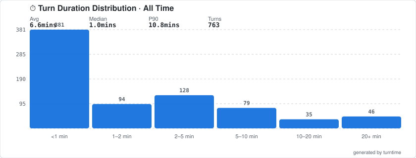
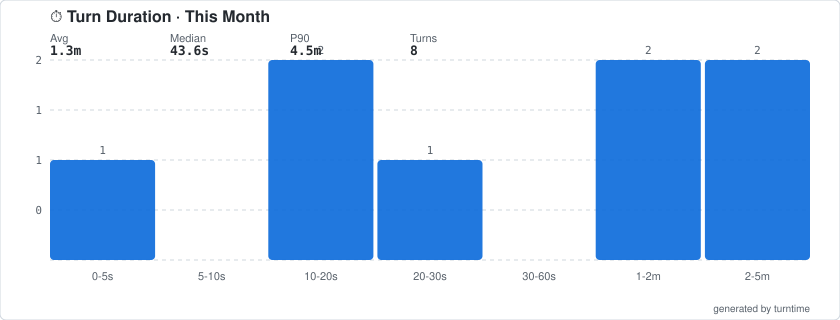

```
      __________  __  __   ____    __  ___
        /___ __/_/ / / / _/ __ \ _/ | / /
        __/ /  _/ / / / _/ /_/ / /  |/ /
        _/ /   / /_/ / _/ _, _/ / /|  /
        /_/    \____/  /_/ |_| /_/ |_/
           ___________   _____   __  ___   _______
╔══════════╗  /__  __/__/_  _/ _/  |/  / _/ ____/
║    │     ║  __/ /   __/ /   _/ /|_/ / _/ __/
║    ·──   ║  _/ /    _/ /   _/ /  / / _/ /___
║          ║  /_/    /___/   /_/  /_/  /_____/
╚══════════╩═══════════════════════════════════╝
```
## TURN DURATION IS THE NEW FLEX FOR AI PROGRAMMERS...WHERE DO YOU STACK UP?

**Track and display your Claude Code turn duration on your GitHub profile.**

Anthropic's research shows that the top 0.1% of Claude Code users have average turn durations [nearly double](https://www.anthropic.com/research/agent-autonomy) everyone else's — and climbing. These are the power users tackling the most complex, ambitious work: the kind where Claude reads dozens of files, orchestrates multi-step tool chains, runs tests, refactors, and delivers — all in a single turn. Turn duration is one of the clearest signals of how much autonomy you're granting your agent, and how hard the problems you're throwing at it actually are.

turntime makes that visible. It parses your local Claude Code session logs, calculates your turn durations, and generates badges and histogram charts you can display on your GitHub profile — because if you're going to let an AI work unsupervised for 30 minutes, you might as well get props for it.

 

<picture>
  
</picture>

<picture>
  
</picture>

## Why turn duration matters

Most Claude Code turns are short. The median across all users is around 45 seconds. Nearly every percentile below the 99th has held steady for months — that's what happens when a product is growing fast and new users are still learning the tool.

The interesting signal is in the tail. Between October 2025 and January 2026, the 99.9th percentile turn duration nearly doubled, from under 25 minutes to over 45 minutes. This wasn't driven by model releases — it was a smooth trend, suggesting that power users are building trust over time, attempting more ambitious tasks, and letting Claude work independently for longer.

Internally at Anthropic, Claude Code's success rate on the hardest tasks doubled between August and December, while human interventions per session dropped from 5.4 to 3.3. Users are granting more autonomy *and* getting better outcomes.

**Where do you fall on that curve?** turntime lets you find out. Whether you should *tell* people is between you and your conscience.

## Install

**Prerequisites:**
- **Python 3.9+** — check with `python3 --version`
- **[Claude Code](https://claude.ai/download)** — you need at least one session. If you just installed Claude Code, open it, ask it any question, and you're good to go. turntime reads the session logs it creates at `~/.claude/projects/`.
- **GitHub authentication** (for syncing to your profile) — either:
  - [GitHub CLI (`gh`)](https://cli.github.com/) — install it, then run `gh auth login`
  - Or set a `GITHUB_TOKEN` environment variable: `export GITHUB_TOKEN=your_token`

**macOS / Linux:**

```bash
curl -fsSL https://raw.githubusercontent.com/Trevor-Mengel/turntime/main/setup.sh | bash
```

This clones turntime to `~/.local/share/turntime` and adds a `turntime` command to your PATH.

**Windows / manual install:**

```bash
git clone https://github.com/Trevor-Mengel/turntime.git
cd turntime
python3 scripts/turntime_cli.py stats
```

On Windows, use `python` instead of `python3` if that's how Python is installed. You can create an alias or run the scripts directly from the cloned directory.

## What it measures

**Turn duration** = the wall-clock time from when you send a prompt to when Claude finishes its complete response — including every intermediate tool call in between.

When Claude reads 14 files, edits 3, runs the test suite, and refactors based on the results — that's one turn. You were probably making coffee. turntime captures the full duration of that autonomous work, not just the final response.

Technical details:
- Tool results (`user` messages with `tool_result` content blocks) are correctly identified and skipped — multi-step tool chains count as a single turn, not dozens of micro-turns
- Subagent processes (background Task tool spawns) are excluded — only your direct Claude Code sessions are measured
- Turns under 5 seconds are filtered out (quick confirmations and short terminal commands)
- No upper cap — if Claude wants to work for an hour, who are we to stop it

## Quick start

```bash
turntime stats
```

```
⏱  turntime stats (712 turns from 108 sessions)

Period                Avg   Median      P90      Min      Max    Count
────────────────────────────────────────────────────────────────────────
Today              605.7s   222.6s  2596.4s     4.2s  2900.9s       27
This Week          503.2s    99.6s  1251.3s     4.2s 12395.8s      210
This Month         376.4s    52.4s   645.5s     0.6s 22822.4s      648
All Time           412.1s    53.4s   661.5s     0.6s 24853.5s      712
```

## Setup for GitHub profile

### 1. Create a GitHub profile repo (if you don't have one)

GitHub displays a special README on your profile when you create a repository that matches your username. If you already have one, skip to step 2.

1. Go to [github.com/new](https://github.com/new)
2. Set the **Repository name** to your exact GitHub username (e.g., if you're `janedoe`, name it `janedoe`)
3. Check **Public**
4. Check **Add a README file**
5. Click **Create repository**

You should now see a "Hi there" message on your profile at `github.com/<your-username>`.

### 2. Clone your profile repo locally

```bash
# Replace YOUR_USERNAME with your GitHub username
git clone https://github.com/YOUR_USERNAME/YOUR_USERNAME.git ~/YOUR_USERNAME
```

This downloads your profile repo to your home directory. You'll give this path to turntime in the next step.

### 3. Initialize turntime

```bash
turntime init
```

This will:
- Verify Claude Code logs exist on your machine
- Authenticate with GitHub (via `gh` CLI or `GITHUB_TOKEN`)
- Create a public Gist to host your stats
- Ask for your **profile repo path** — enter the path from step 2 (e.g., `~/YOUR_USERNAME`)
- Save config to `~/.config/turntime/config.json`

### 4. Add placeholder comments to your profile README

Open the `README.md` inside your profile repo and add these comment markers wherever you want your stats to appear:

```markdown
<!-- turntime badges -->
<!-- /turntime badges -->

<!-- turntime distribution -->
<!-- /turntime distribution -->

<!-- turntime histogram -->
<!-- /turntime histogram -->
```

Save the file. turntime will inject your badges and charts between these markers automatically. The distribution and histogram sections are optional — include whichever you want (or both).

### 5. Sync your stats

```bash
turntime sync
```

This parses your Claude Code logs, generates badges and a histogram SVG, pushes them to your GitHub Gist, updates your profile README, and pushes the changes to GitHub.

After it finishes, visit `github.com/<your-username>` — you should see your badges and histogram chart.

### 6. Pin your Gist (optional)

When you ran `turntime init`, it created a public Gist with a live dashboard showing your weekly average. You can pin this Gist to your GitHub profile:

1. Go to your GitHub profile (`github.com/<your-username>`)
2. Click **Customize your pins**
3. Select the turntime Gist (named "turntime - Claude Code turn duration stats")

The pinned Gist will update automatically every time you run `turntime sync`.

### 7. Automate updates (optional)

A ready-to-use wrapper script is included at [`sync-cron.sh`](sync-cron.sh). It loads your GitHub token from `~/.config/turntime/.env` so it works in non-interactive shells where `gh auth token` can't access the keychain.

**Setup:**

1. Create your env file:
   ```bash
   echo "GH_TOKEN=$(gh auth token)" > ~/.config/turntime/.env
   ```

2. **cron (any platform):**
   ```bash
   crontab -e
   ```
   ```cron
   0 */6 * * * ~/.local/share/turntime/sync-cron.sh >> ~/.config/turntime/logs/sync.log 2>&1
   ```

3. **macOS launchd:**
   ```bash
   cat > ~/Library/LaunchAgents/com.turntime.sync.plist << 'EOF'
   <?xml version="1.0" encoding="UTF-8"?>
   <!DOCTYPE plist PUBLIC "-//Apple//DTD PLIST 1.0//EN" "http://www.apple.com/DTDs/PropertyList-1.0.dtd">
   <plist version="1.0">
   <dict>
       <key>Label</key><string>com.turntime.sync</string>
       <key>ProgramArguments</key>
       <array>
           <string>/bin/bash</string>
           <string>-c</string>
           <string>~/.local/share/turntime/sync-cron.sh</string>
       </array>
       <key>StartInterval</key><integer>21600</integer>
       <key>StandardOutPath</key><string>~/.config/turntime/logs/sync.log</string>
       <key>StandardErrorPath</key><string>~/.config/turntime/logs/sync.log</string>
   </dict>
   </plist>
   EOF
   launchctl load ~/Library/LaunchAgents/com.turntime.sync.plist
   ```

### 8. Automate with GitHub Actions (optional)

If you want stats to update even when your machine is off, you can use a GitHub Action. This requires committing `turntime-stats.json` to your profile repo first.

**Setup:**

1. Generate and commit the stats file to your profile repo:
   ```bash
   turntime sync --local-only
   cp .turntime-output/turntime-stats.json ~/YOUR_USERNAME/
   cd ~/YOUR_USERNAME
   git add turntime-stats.json && git commit -m "add turntime stats" && git push
   ```

2. Copy the workflow file from this repo to your profile repo:
   ```bash
   mkdir -p ~/YOUR_USERNAME/.github/workflows
   cp /path/to/turntime/Trevor-Mengel/.github/workflows/update-stats.yml ~/YOUR_USERNAME/.github/workflows/
   ```

3. Add these repository secrets (Settings > Secrets and variables > Actions):
   - `TURNTIME_GIST_ID` — your Gist ID (find it in `~/.config/turntime/config.json`)
   - `TURNTIME_GIST_TOKEN` — a [fine-grained PAT](https://github.com/settings/personal-access-tokens/new) with **Gists** (read/write) and **Contents** (read/write) permissions

4. The action runs daily at 6am UTC. You can also trigger it manually from the Actions tab.

## CLI reference

```bash
# Show stats in terminal
turntime stats
turntime stats --project myproject    # filter by project name

# Generate files locally without pushing
turntime sync --local-only
turntime sync --local-only --theme dark

# Generate both time-series and distribution charts
turntime sync --local-only --chart-type both

# Full sync: parse → generate → push to Gist → update README
turntime sync
turntime sync --chart-type both       # include distribution chart
turntime sync --project myproject     # sync only a specific project
turntime sync --config /path/to/config.json  # use custom config

# Initialize configuration
turntime init
```

### Individual scripts

The scripts can also be used independently:

```bash
# Parse sessions to JSON
python3 scripts/parse_sessions.py --output stats.json --verbose

# Generate histogram SVG (time-series or distribution)
python3 scripts/generate_histogram.py stats.json --output histogram.svg --theme auto
python3 scripts/generate_histogram.py stats.json --chart-type distribution --output distribution.svg

# Generate badge markdown
python3 scripts/generate_badges.py stats.json --format markdown
```

## Configuration

Config is stored at `~/.config/turntime/config.json`:

```json
{
  "gist_id": "abc123...",
  "github_username": "janedoe",
  "profile_repo": "~/janedoe",
  "badge_periods": ["week", "all"],
  "badge_metric": "avg",
  "badge_style": "for-the-badge",
  "badge_delta": true,
  "badge_delta_baseline": "all",
  "theme": "auto",
  "chart_type": "timeseries"
}
```

| Key | Description | Default |
|-----|-------------|---------|
| `gist_id` | GitHub Gist ID for hosting stats | Set by `init` |
| `github_username` | Your GitHub username (for Gist raw URLs) | Set by `init` |
| `profile_repo` | Local path to your profile repo | Optional |
| `badge_periods` | Which periods to show as badges | `["week", "all"]` |
| `badge_metric` | Metric to display: `"avg"`, `"median"`, `"p90"`, `"count"` | `"avg"` |
| `badge_style` | shields.io badge style: `"flat"`, `"flat-square"`, `"plastic"`, `"for-the-badge"` | `"for-the-badge"` |
| `badge_delta` | Show ▲/▼ percentage vs baseline period | `true` |
| `badge_delta_baseline` | Period to compare against for delta | `"all"` |
| `theme` | SVG theme: `"auto"`, `"dark"`, `"light"` | `"auto"` |
| `chart_type` | Chart type: `"timeseries"`, `"distribution"`, `"both"` | `"timeseries"` |

### Badge examples

**Default** — weekly average with delta vs all-time:
```json
{ "badge_periods": ["week", "all"], "badge_metric": "avg", "badge_delta": true }
```
>  

**Median-focused** — useful if your distribution is skewed:
```json
{ "badge_periods": ["week", "all"], "badge_metric": "median" }
```

**No delta** — just the raw durations:
```json
{ "badge_periods": ["today", "month", "all"], "badge_delta": false }
```

**Flat-square style** — compact alternative:
```json
{ "badge_style": "flat-square" }
```

## How it works

1. **Reads** Claude Code session logs from `~/.claude/projects/**/*.jsonl`
2. **Parses** each JSONL file to extract timestamped messages, distinguishing genuine human prompts from tool_result messages (which share `role: "user"` in the Claude API)
3. **Calculates** turn duration from your prompt to Claude's final response, spanning all intermediate tool-use cycles
4. **Aggregates** into time periods (day, week, month, quarter, year, all-time)
5. **Generates** shields.io badge URLs, a weekly time-series histogram, and an optional frequency distribution chart
6. **Pushes** to a GitHub Gist (for dynamic badge endpoints)
7. **Updates** your profile README with badge images and the histogram

### Privacy

turntime **never** reads your prompts or code. It only extracts:
- Timestamps (to calculate duration)
- Message roles (to identify user vs assistant turns)
- Token counts (for optional usage stats)
- Tool use counts (for optional complexity metrics)
- Session IDs and project directory names

Your prompts, code, and questionable variable names stay between you and Claude.

## Badge colors

Badges use [shields.io](https://shields.io) with a Tailwind-inspired color palette. The progression reflects the research — longer turns correlate with more complex, more autonomous work:

| Duration | Tier | Color | Hex |
|----------|------|-------|-----|
| < 2m | Routine | ⚫ Slate | `#475569` |
| 2–5m | Engaged | 🟡 Amber | `#f59e0b` |
| 5–10m | Deep Work | 🟢 Teal | `#14b8a6` |
| 10–20m | Power User | 🔵 Indigo | `#6366f1` |
| 20–40m | Top 1% | 🟣 Fuchsia | `#d946ef` |
| ≥ 40m | 99.9th Percentile | ⚪ White | `#ffffff` |

### Dynamic badges (recommended)

Use the Gist endpoint for auto-updating badges:

```markdown

```

### Static badges

Or use direct shields.io URLs (generated by the badge script):

```markdown

```

## Chart themes

Both the time-series histogram and frequency distribution chart support GitHub's automatic dark/light theme via `prefers-color-scheme`:

- **`auto`** (default) — adapts to the viewer's GitHub theme
- **`dark`** — always dark background
- **`light`** — always light background

## Requirements

- Python 3.9+
- Claude Code installed (with at least one session in `~/.claude/projects/`)
- `gh` CLI or `GITHUB_TOKEN` environment variable (for Gist sync)
- No external Python dependencies — uses only the standard library
- A willingness to quantify your relationship with an AI (you're already here)

## Troubleshooting

**`turntime: command not found`**
Your shell doesn't see `~/.local/bin`. Either restart your terminal (the installer added it to your shell config) or run directly: `python3 ~/.local/share/turntime/turntime.py stats`

**`No session files found`**
Claude Code hasn't created any session logs yet. Open Claude Code, send at least one message, then try again. Logs are stored in `~/.claude/projects/`.

**`No turns extracted from session files`**
Your session files exist but don't contain complete user-to-assistant message pairs. This can happen with very short sessions or interrupted conversations. Try having a longer conversation with Claude Code first.

**`GitHub API error (401)`**
Your token is invalid or expired. Re-authenticate: `gh auth login` or update your `GITHUB_TOKEN` environment variable.

**`GitHub API error (403)`**
Your token doesn't have the right permissions. For Gist sync you need a token with **Gists** read/write access. Create a new [fine-grained PAT](https://github.com/settings/personal-access-tokens/new) with the Gists permission.

**`GitHub API error (404)`**
Your Gist ID is invalid. Run `turntime init` again to create a new Gist, or check `~/.config/turntime/config.json` and verify `gist_id` is correct.

**Badges or histogram not appearing on profile**
Make sure your profile README has the comment markers (`<!-- turntime badges -->` ... `<!-- /turntime badges -->`) and that you ran `turntime sync` (not just `--local-only`). Check that your profile repo was pushed: `cd ~/YOUR_USERNAME && git status`.

**Cron/launchd sync not working**
The `gh auth token` command requires keychain access, which doesn't work in non-interactive shells. Store your token in `~/.config/turntime/.env` as `GH_TOKEN=your_token` and use the included `sync-cron.sh` wrapper script.

## Roadmap

- [ ] Global and regional leaderboards W(^,^)W
- [ ] Public website for leaderboard display
- [ ] `pip install turntime` package distribution
- [ ] Additional metrics (tokens/turn, tool uses/turn, complexity score)
- [ ] Claude Code hook integration for real-time tracking
- [ ] Trend lines and rolling averages
- [ ] Per-project breakdown charts

## Contributing

Contributions welcome! See [CONTRIBUTING.md](CONTRIBUTING.md) for guidelines.

## License

MIT — see [LICENSE](LICENSE).
